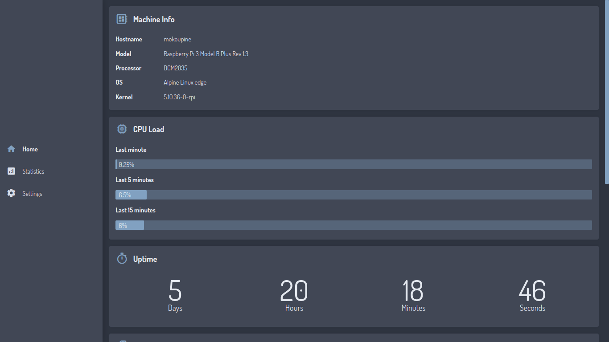
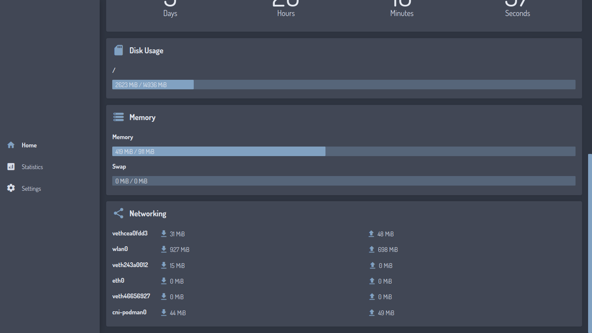

# RasPy-Monitor
A monitoring tool for Raspberry Pi written in Python with Flask and Vue.js, currently it's not yet done as not everything is implemented and things are constantly changing and breaking, here's a list of TODOs:

1. Display statistics from the last 24 hours.
2. Monitor system services.
3. Non-environment-variable configuration.
4. Monitor multiple Raspberry Pi devices.
5. (Maybe) Performance tweaking.

## Usage
### With Virtual Environment
It's recommended to use virtual environment rather than installing the libraries globally, You'll need Python 3.9

```sh
python3 -m venv virtualenv
source virtualenv/bin/activate  # Or use your shell equivalent
pip install -r requirements.txt
python3 app.py
```

App can be accessed from port 5000

### With Docker
You can also use Docker or similar container solutions such as Podman, the process runs with uid 999.

```sh
docker volume create raspy-monitor
docker run \
    --rm -p 5000:5000 \
    -v raspy-monitor:/config \
    -v /:/host:ro \
    -e ROOT_PATH=/host \
    -e DEBUG=1 \
    -h $(uname -n) \
    docker.io/lemniskett/raspy-monitor:latest
```

## Configuration
Configuration currently only can be done with environment variables :
| Variable | Description |
| --- | --- |
| IGNORE_INTERFACES | Exclude network interface from network monitoring, defaults to `lo` (loopback interface). |
| MOUNT_POINTS | Specify mount points to be monitored, defaults to `/`. |
| ROOT_PATH | Specify which operating system root to be monitored, useful for running inside containers. |
| DB_PATH | Specify where to create or look for sqlite database, defaults to `./raspy_monitor.db` (`/config/raspy_monitor.db` for docker container). |
| DEBUG | For development purposes, setting it to anything will enable debugging, both backend and frontend. |

## Screenshots




